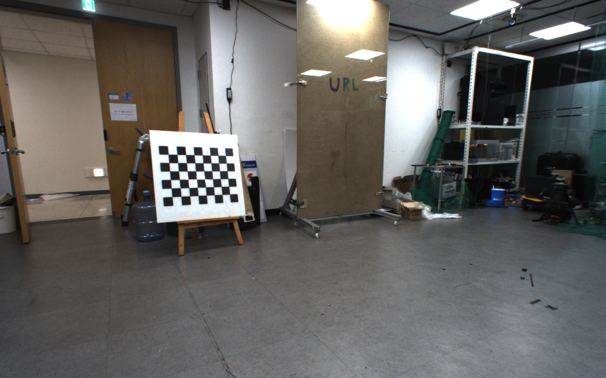
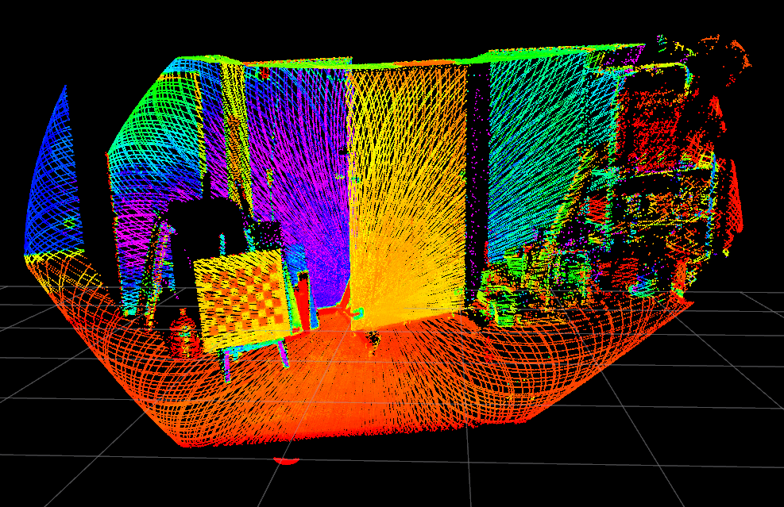
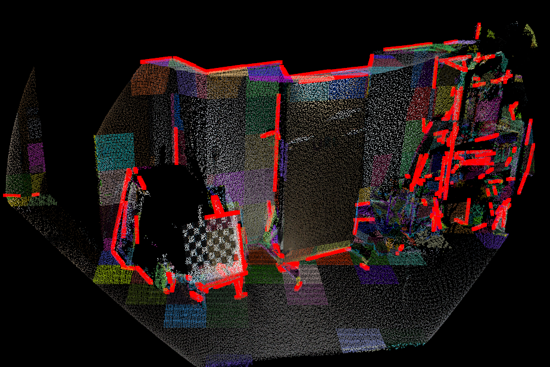
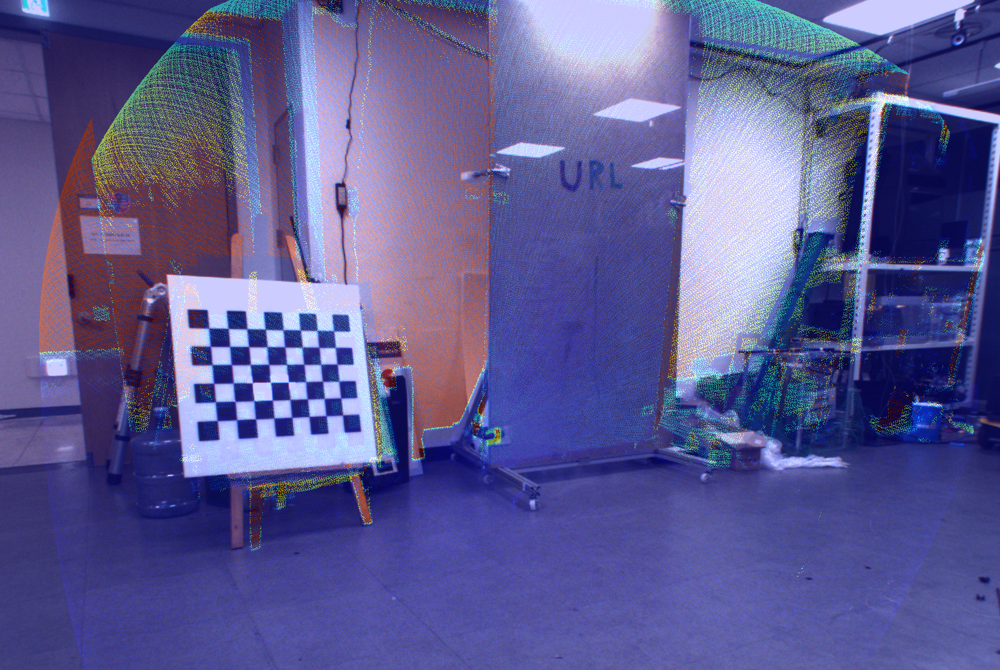
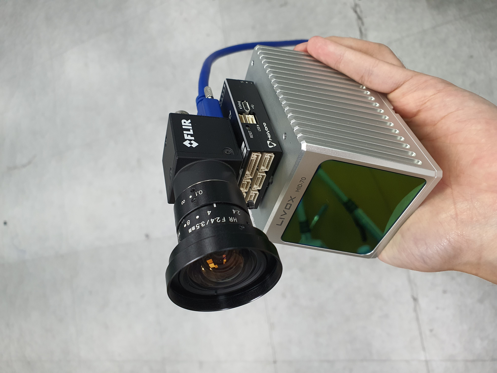

# SLAM-application: installation and test
+ 3D, single-LiDAR: [LeGO-LOAM](https://github.com/RobustFieldAutonomyLab/LeGO-LOAM), [LIO-SAM](https://github.com/TixiaoShan/LIO-SAM), [LVI-SAM](https://github.com/TixiaoShan/LVI-SAM), [FAST-LIO2](https://github.com/hku-mars/FAST_LIO), [Faster-LIO](https://github.com/gaoxiang12/faster-lio), [VoxelMap](https://github.com/hku-mars/VoxelMap), [R3LIVE](https://github.com/hku-mars/r3live), [DLO](https://github.com/vectr-ucla/direct_lidar_odometry), [PV-LIO](https://github.com/HViktorTsoi/PV-LIO), [SLAMesh](https://github.com/RuanJY/SLAMesh), and [ImMesh](https://github.com/hku-mars/ImMesh)
+ 3D, multi-LiDARs: [FAST-LIO-MULTI](https://github.com/engcang/FAST_LIO_MULTI), [SLICT1.0](https://github.com/brytsknguyen/slict/releases/tag/slict.1.0), and [MA-LIO](https://github.com/minwoo0611/MA-LIO)

<br>

## ● Results: 
### Single-LiDAR
+ [`video`](https://youtu.be/RCY_q_d2Xm0): Lego-LOAM vs LIO-SAM vs LVI-SAM
+ [`video2`](https://youtu.be/WvgGqeyHNzs): LIO-SAM vs LVI-SAM
+ [`video3`](https://youtu.be/3d4WtK6S4Ms): LIO-SAM vs FAST-LIO2
+ [`video4`](https://youtu.be/NmT0o268OLM): FAST-LIO2 vs Livox-mapping vs LOAM-Livox using [`Livox Mid-70 LiDAR`](https://www.livoxtech.com/mid-70), real-world
+ [`video5`](https://youtu.be/_RgtOdK53z4): FAST-LIO2 in the building with narrow stairs using [`Ouster OS0-128`](https://ouster.com/products/scanning-lidar/os0-sensor/), real-world
+ [`video6`](https://youtu.be/emiSJMcA8yM): FAST-LIO2 in the narrow tunnels using [`Ouster OS0-128`](https://ouster.com/products/scanning-lidar/os0-sensor/) on the UAV (drone)
+ [`video7`](https://youtu.be/kr9Z2e8I7YQ): Faster-LIO vs FAST-LIO in the building with narrow stairs using [`Ouster OS0-128`](https://ouster.com/products/scanning-lidar/os0-sensor/), real-world
+ [`video8`](https://youtu.be/7m2XBfcgJPM): VoxelMap in the building using [`Intel Realsense L515`](https://www.intelrealsense.com/lidar-camera-l515/), real-world
+ [`video9`](https://youtu.be/NYaT-bxGjvY): R3LIVE in the building and around the building using [`Livox Mid-70 LiDAR`](https://www.livoxtech.com/mid-70), [`FLIR Blackfly S`](https://www.flirkorea.com/products/blackfly-s-usb3/), [`Pixhawk4 mini`](http://www.holybro.com/product/pixhawk4-mini/), real-world
+ [`video10`](https://youtu.be/3QTjUONviYo): FAST-LIO2 vs Ada-LIO vs Point-LIO vs KISS-ICP in the building with narrow stairs, real-world
+ [`video11`](https://youtu.be/vxFBvXTuFoU): FAST-LIO2 vs Ada-LIO in Gazebo challenging environments
+ [`video12`](https://youtu.be/0udb2fRG6HY): DLO vs FAST-LIO2
+ [`video13`](https://youtu.be/r9wwldPYKUw): DLO vs DLIO vs Ada-LIO vs FAST-LIO2
+ [`video15`](https://youtu.be/NHPvLbztawY): Ada-LIO vs PV-LIO vs SLAMesh
+ [`video16`](https://youtu.be/0sVkY66pOpI): Ada-LIO vs PV-LIO
+ [`video17`](https://youtu.be/rOOKY9HVHzI): Ada-LIO vs ImMesh
### Multi-LiDARs
+ [`video14`](https://youtu.be/YQmjKMoBPNU): FAST-LIO-MULTI bundle update vs asynchronous update
---

<br>

## Dependencies
+ Common packages
~~~bash
$ sudo apt-get install -y ros-melodic-navigation ros-melodic-robot-localization ros-melodic-robot-state-publisher
~~~

+ [GTSAM](https://github.com/borglab/gtsam/releases) for `LVI-SAM` and `LIO-SAM`
~~~bash
$ wget -O gtsam.zip https://github.com/borglab/gtsam/archive/4.0.2.zip
$ unzip gtsam.zip
$ cd gtsam-4.0.2/
$ mkdir build && cd build
$ cmake -DGTSAM_BUILD_WITH_MARCH_NATIVE=OFF -DGTSAM_USE_SYSTEM_EIGEN=ON ..
$ sudo make install -j8
~~~

+ [Ceres solver](http://ceres-solver.org) for `LVI-SAM`, `SLAMesh`, and `SLICT1.0`
~~~bash
$ sudo apt-get install -y cmake libgoogle-glog-dev libatlas-base-dev libsuitesparse-dev
$ wget http://ceres-solver.org/ceres-solver-1.14.0.tar.gz #LVI-SAM
$ wget http://ceres-solver.org/ceres-solver-2.1.0.tar.gz #SLAMesh
$ tar zxf ceres-solver-1.14.0.tar.gz #LVI-SAM
$ tar zxf ceres-solver-2.1.0.tar.gz #SLAMesh, SLICT1.0
$ mkdir ceres-bin
$ mkdir solver && cd ceres-bin
$ cmake ../ceres-solver-1.14.0 -DEXPORT_BUILD_DIR=ON -DCMAKE_INSTALL_PREFIX="../solver"  #good for build without being root privileged and at wanted directory
$ make -j8 # 8 : number of cores
$ make test
$ make install
~~~

+ `glog`, `g++-9` and `gcc-9` for `Faster-LIO`
~~~bash
$ sudo apt-get install libgoogle-glog-dev
$ sudo add-apt-repository ppa:ubuntu-toolchain-r/test
$ sudo apt update
$ sudo apt install gcc-9 g++-9
$ sudo update-alternatives --install /usr/bin/gcc gcc /usr/bin/gcc-9 60 --slave /usr/bin/g++ g++ /usr/bin/g++-9
~~~

#### Note: When `Ouster-ros` package cannot be built with `gcc` and `g++` with the version higher than 6,
+ When building `ouster-ros`,
```bash
catkin b -DCMAKE_C_COMPILER=gcc-6 -DCMAKE_CXX_COMPILER=g++-6 -DCMAKE_BUILD_TYPE=Release
```

+ `CGAL` and `pcl-tools` for `R3LIVE`
```bash
$ sudo apt install libcgal-dev pcl-tools

Optionally,
$ sudo apt install meshlab
```
---

<br>

## Installation
### ● LeGO-LOAM
~~~shell
$ cd ~/your_workspace/src
$ git clone https://github.com/RobustFieldAutonomyLab/LeGO-LOAM.git
$ cd ..
$ catkin build -DCMAKE_BUILD_TYPE=Release
~~~

<br>

### ● LIO-SAM
~~~shell
$ cd ~/your_workspace/src
$ git clone https://github.com/TixiaoShan/LIO-SAM.git
$ cd ..
$ catkin build -DCMAKE_BUILD_TYPE=Release
~~~

<br>

### ● LVI-SAM
~~~shell
$ cd ~/your_workspace/src
$ git clone https://github.com/TixiaoShan/LVI-SAM.git
$ cd ..
$ catkin build -DCMAKE_BUILD_TYPE=Release
~~~
#### ● Trouble shooting for LVI-SAM
+ for `OpenCV 4.X`, edit `LVI-SAM/src/visual_odometry/visual_loop/ThirdParty/DVision/BRIEF.cpp:53`
~~~cpp
// cv::cvtColor(image, aux, CV_RGB2GRAY);
cv::cvtColor(image, aux, cv::COLOR_RGB2GRAY);
~~~

<br>

### ● FAST-LIO2
~~~shell
$ cd ~/your_workspace/src
$ git clone https://github.com/Livox-SDK/livox_ros_driver.git
$ cd ..
$ catkin build -DCMAKE_BUILD_TYPE=Release

$ cd ~/your_workspace/src
$ git clone --recursive https://github.com/hku-mars/FAST_LIO.git
$ cd ..
$ catkin build -DCMAKE_BUILD_TYPE=Release
~~~

<br>

### ● Faster-LIO
~~~shell
$ cd ~/your_workspace/src
$ git clone https://github.com/gaoxiang12/faster-lio.git

$ cd faster-lio/thirdparty
$ tar -xvf tbb2018_20170726oss_lin.tgz

$ cd ~/your_workspace
$ catkin build -DCUSTOM_TBB_DIR=$(pwd)/src/faster-lio/thirdparty/tbb2018_20170726oss -DCMAKE_BUILD_TYPE=Release
~~~


### ● Faster-LIO on `ARM` architecture (e.g., Jetson Xavier)
~~~shell
$ cd ~/your_workspace/src
$ git clone https://github.com/gaoxiang12/faster-lio.git

$ cd faster-lio/thirdparty
$ git clone https://github.com/syoyo/tbb-aarch64
$ cd tbb-aarch64
$ ./scripts/bootstrap-aarch64-linux.sh
$ cd build-aarch64
$ make && make install

$ gedit faster-lio/cmake/packages.cmake

Edit line 13 as:
    #set(TBB2018_LIBRARY_DIR "${CUSTOM_TBB_DIR}/lib/intel64/gcc4.7")
    set(TBB2018_LIBRARY_DIR "${CUSTOM_TBB_DIR}/lib")


$ cd ~/your_workspace
$ catkin build -DCUSTOM_TBB_DIR=$(pwd)/src/faster-lio/thirdparty/tbb-aarch64/dist -DCMAKE_BUILD_TYPE=Release
~~~

<br>

### ● VoxelMap
```bash
$ cd ~/your_workspace/src
$ git clone https://github.com/Livox-SDK/livox_ros_driver.git
$ cd ..
$ catkin build -DCMAKE_BUILD_TYPE=Release

$ git clone https://github.com/hku-mars/VoxelMap.git
$ cd ..
$ catkin build -DCMAKE_BUILD_TYPE=Release
```

#### ● Trouble shooting for VoxelMap
+ `/usr/include/lz4.h:196:57: error: conflicting declaration ‘typedef struct LZ4_stream_t LZ4_stream_t’ ...`
  + You could meet this error in `ROS-melodic`. Fix as [here](https://github.com/ethz-asl/lidar_align/issues/16#issuecomment-504348488)
~~~bash
$ sudo mv /usr/include/flann/ext/lz4.h /usr/include/flann/ext/lz4.h.bak
$ sudo mv /usr/include/flann/ext/lz4hc.h /usr/include/flann/ext/lz4.h.bak

$ sudo ln -s /usr/include/lz4.h /usr/include/flann/ext/lz4.h
$ sudo ln -s /usr/include/lz4hc.h /usr/include/flann/ext/lz4hc.h
~~~

<br>

### ● R3LIVE
```bash
$ cd ~/your_workspace/src
$ git clone https://github.com/hku-mars/r3live.git
$ cd ..
$ catkin build -DCMAKE_BUILD_TYPE=Release
```

#### ● Trouble shooting for R3LIVE
+ `LiDAR incoming frame too old ...`
  + Original `Livox-ros-driver` does not publish the data with `ROS` timestamp, but `LiDAR` time.
  + So, use `modified livox-ros-driver` [here](https://github.com/ziv-lin/livox_ros_driver_for_R2LIVE)
  + If that does not solve the problem, edit `lddc.cpp` yourself, line 563:
  ```c++
  //livox_msg.header.stamp = ros::Time((timestamp - init_lidar_tim - packet_offset_time )  / 1e9 + init_ros_time);
    livox_msg.header.stamp = ros::Time::now();
    /**************** Modified for R2LIVE **********************/
    ros::Publisher *p_publisher = Lddc::GetCurrentPublisher(handle);
    if (kOutputToRos == output_type_)
    {
      p_publisher->publish(livox_msg);
    }
  ```

#### ● How to properly set configuration for R3LIVE
+ Camera calibration - use `Kalibr` or `camera_calibration`
  + `Kalibr` - refer original [repo](https://github.com/ethz-asl/kalibr)
  + `camera_calibration` - use as [here](https://github.com/heethesh/lidar_camera_calibration)
+ Lidar-Camera calibration
  + Other spinning LiDARs are not supported yet (for RGB mapping), but try to use `lidar_camera_calibration` [repo](https://github.com/heethesh/lidar_camera_calibration), if you want to.
  + For `LiVOX` LiDAR, use `livox_camera_calib` [repo](https://github.com/hku-mars/livox_camera_calib)
    + Record a `bag file` of LiVOX LiDAR data and capture the image from `RGB camera` you use.
    + Convert a `bag file` into a `PCD file` with (change directories in the launch file):
    ```bash
    $ roslaunch livox_camera_calib bag_to_pcd.launch
    ```
    + Then, calibrate LiDAR and camera as (change directories in the launch and config files):
    ```bash
    $ roslaunch livox_camera_calib calib.launch
    ```
#### **★Note**: extrinsic rotational parameter from `livox_camera_calib` should be transposed in the `r3live_config.yaml` file. Refer my [extrinsic result](r3live/extrinsic.txt) and [r3live config file](r3live/r3live_config.yaml)

<p align="center">
  
  
  <br>
  <em>Left: Target image. Right: Target PCD</em>
</p>
<p align="center">
  
  
  <br>
  <em>Left: calibrated image and residuals. Right: calibrated image</em>
</p>
 
<p align="center">
  
  <br>
  <em>Sensor configuration of mine: Pixhawk4 mini as an IMU, FLIR Blackfly S USB3 (BFS-U3-23S3C-C), LiVOX MID-70</em>
</p>

<br>

### ● Point-LIO
~~~shell
$ cd ~/your_workspace/src
$ git clone https://github.com/Livox-SDK/livox_ros_driver.git
$ cd ..
$ catkin build -DCMAKE_BUILD_TYPE=Release

$ cd ~/your_workspace/src
$ git clone --recursive https://github.com/hku-mars/Point-LIO.git
$ cd ..
$ catkin build -DCMAKE_BUILD_TYPE=Release
~~~

<br>

### ● KISS-ICP (ROS1)
~~~shell
$ cd ~/your_workspace/src
$ git clone https://github.com/PRBonn/kiss-icp.git
$ cd ..
$ catkin build -DCMAKE_BUILD_TYPE=Release
~~~

<br>

### ● DLO
```shell
$ sudo apt install libomp-dev libpcl-dev libeigen3-dev 
$ cd ~/your_workspace/src
$ git clone https://github.com/vectr-ucla/direct_lidar_odometry.git
$ cd ..
$ catkin build -DCMAKE_BUILD_TYPE=Release
```

<br>

### ● DLIO
```shell
$ sudo apt install libomp-dev libpcl-dev libeigen3-dev 
$ cd ~/your_workspace/src
$ git clone https://github.com/vectr-ucla/direct_lidar_inertial_odometry.git
$ cd ..
$ catkin build -DCMAKE_BUILD_TYPE=Release
```

<br>

### ● PV-LIO
```shell
$ cd ~/your_workspace/src
$ git clone https://github.com/Livox-SDK/livox_ros_driver
$ git clone https://github.com/HViktorTsoi/PV-LIO
$ cd ..
$ catkin build -DCMAKE_BUILD_TYPE=Release
```

<br>

### ● SLAMesh
```shell
$ sudo apt-get install build-essential cmake cmake-curses-gui libflann-dev libgsl-dev libeigen3-dev libopenmpi-dev \
     openmpi-bin opencl-c-headers ocl-icd-opencl-dev libboost-all-dev libopencv-dev libyaml-cpp-dev \
     freeglut3-dev libhdf5-dev qtbase5-dev qt5-default libqt5opengl5-dev liblz4-dev

# Ubuntu 18.04
$ sudo apt-get install libvtk6-dev libvtk6-qt-dev
# Ubuntu 20.04
$ sudo apt-get install libvtk7-dev libvtk7-qt-dev

$ git clone https://github.com/uos/lvr2.git
$ cd lvr2 
$ mkdir build && cd build
$ cmake .. && make
$ sudo make install

$ cd ~/your_workspace/src
$ git clone https://github.com/naturerobots/mesh_tools.git
$ git clone https://github.com/RuanJY/SLAMesh.git
$ cd..
$ catkin build -DCMAKE_BUILD_TYPE=Release
```

#### ● Trouble shooting for SLAMesh
+ With `Ceres` >= 2.0 version and `OpenCV` 4.X version, `ceres.solve` can occur error
+ Delete `OpenCV` dependency in `CMakeLists.txt`
```cmakefile
#target_link_libraries(slamesh ${catkin_LIBRARIES} ${PCL_LIBRARIES} ${OpenCV_LIBS} ${G2O_LIBS} ${CERES_LIBRARIES} ${LVR2_LIBRARIES})
target_link_libraries(slamesh ${catkin_LIBRARIES} ${PCL_LIBRARIES} ${G2O_LIBS} ${CERES_LIBRARIES} ${LVR2_LIBRARIES})
```


<br>

### ● ImMesh
```shell
$ sudo apt-get install ros-noetic-cv-bridge ros-noetic-tf ros-noetic-message-filters ros-noetic-image-transport*
$ sudo apt-get install -y libcgal-dev pcl-tools libgl-dev libglm-dev libglfw3-dev libglew-dev libglw1-mesa-dev libxkbcommon-x11-dev
$ cd ~/your_workspace/src
$ git clone https://github.com/Livox-SDK/livox_ros_driver
$ git clone https://github.com/hku-mars/ImMesh
$ cd ..
$ catkin build -DCMAKE_BUILD_TYPE=Release
```

#### ● Trouble shooting for ImMesh
+ Use Ubuntu >= 20.04. Otherwise, `CGAL` version issue will bother you.

<br>

---

## Installation (Multi-LiDARs)
### ● FAST-LIO-MULTI
```shell
$ cd ~/your_workspace/src
$ git clone https://github.com/Livox-SDK/livox_ros_driver
$ git clone https://github.com/engcang/FAST_LIO_MULTI
$ cd ..
$ catkin build -DCMAKE_BUILD_TYPE=Release
```

<br>

### ● SLICT1.0
+ It need `Ceres` 2.1.0
```shell
sudo apt install libsuitesparse-dev libtbb-dev
sudo apt install ros-noetic-tf2-sensor-msgs ros-noetic-tf-conversions
sudo apt install libatlas-base-dev libeigen3-dev libgoogle-glog-dev
sudo apt install python3-wstool python3-catkin-tools python3-osrf-pycommon

cd workspace_1
git clone https://github.com/Livox-SDK/Livox-SDK
cd Livox-SDK/build
cmake .. && sudo make install -j12

cd workspace_1
git clone https://github.com/Livox-SDK/Livox-SDK2
cd Livox-SDK2 && mkdir build && cd build
cmake .. && sudo make install -j12

cd workspace_1/src
git clone https://github.com/livox-SDK/livox_ros_driver
git clone https://github.com/livox-SDK/livox_ros_driver2
cd livox_ros_driver2
./build.sh ROS1


>>> Make chained workspace, it will be good for your mental health
>>> because of livox_ros_driver2
cd workspace_2
source workspace_1/devel/setup.bash

cd workspace_2/src
git clone https://github.com/brytsknguyen/ufomap 
cd ufomap && git checkout devel_surfel

cd workspace_2/src
wget https://github.com/brytsknguyen/slict/archive/refs/tags/slict.1.0.tar.gz
tar -zxf slict.1.0.tar.gz
cd ..
catkin build
```

<br>

### ● MA-LIO
```shell
cd workspace/src
git clone https://github.com/minwoo0611/MA-LIO.git
cd..
catkin build
```
#### ● Trouble shooting for MA-LIO
+ If you get `PCL` error, just comment the `find_package` in `MA_LIO/CMakeLists.txt`
```cmake
#before
find_package(PCL 1.8 REQUIRED)
#after
#find_package(PCL 1.8 REQUIRED)
```

---

<br>

## How to run
#### ● check each of config files and launch files in the folders of this repo

#### Trouble shooting for [`Gazebo Velodyne plugin`](https://bitbucket.org/DataspeedInc/velodyne_simulator/src/master/)
+ When using `CPU ray`, instead of `GPU ray`, height - width should be interchanged, I used [this script file](https://github.com/engcang/SLAM-application/blob/main/lidar_repair.py)
